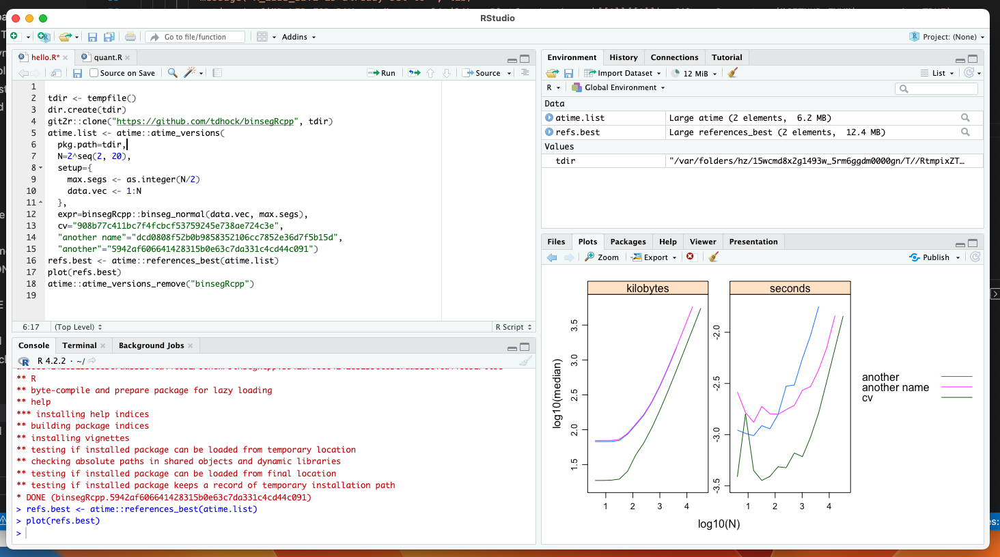

# R_GA_GSOC
For the R GSOC project [Github action for atime](https://github.com/rstats-gsoc/gsoc2023/wiki/Github%20action%20for%20atime)
## Milestones
### Easy & Medium Task
I modified the R Github Action [check-r-package](https://github.com/r-lib/actions/tree/v2/check-r-package) so that it will log out "No testthat output available" if there is no testthat output.

The original code snippet:
```bash
find check -name 'testthat.Rout*' -exec cat '{}' \; || true
```

My modified one:
```bash
TESTTHAT_OUTPUT=$(find check -name 'testthat.Rout*' -exec cat '{}' \; )
if [ -z "$TESTTHAT_OUTPUT" ]; then
    echo  "No testthat output available."
else
    echo $TESTTHAT_OUTPUT
fi
```
### Hard Task

### Current Progress
Hardcoded the `atime_versions()` in to GitHub Action shell script and trying to link the configurations.

## Foreseable Challenges
To install packages, it probably needs to set some environment variables to let R find the packages installed.

## Questions
### Packaged with r-lib/actions/setup-r and r-lib/actions/setup-r-dependencies in it or not?
If not packaged in it, the user has to specify atime in their `r-lib/actions/setup-r-dependencies`. If packaged, there will be less flexibility for the user.
### Using actions/check-out or git2r?
Both are probably feasible.
### How to test?
I find that the plot can be significantly different even on the same commits. I cannot come up with an ideal plan of testing. A potential plan is to delibrately add some codes to slow down the performance, for example sleeping for a while and then compare the changes in performance. But still, it won't be 100% sure that my codes are working.